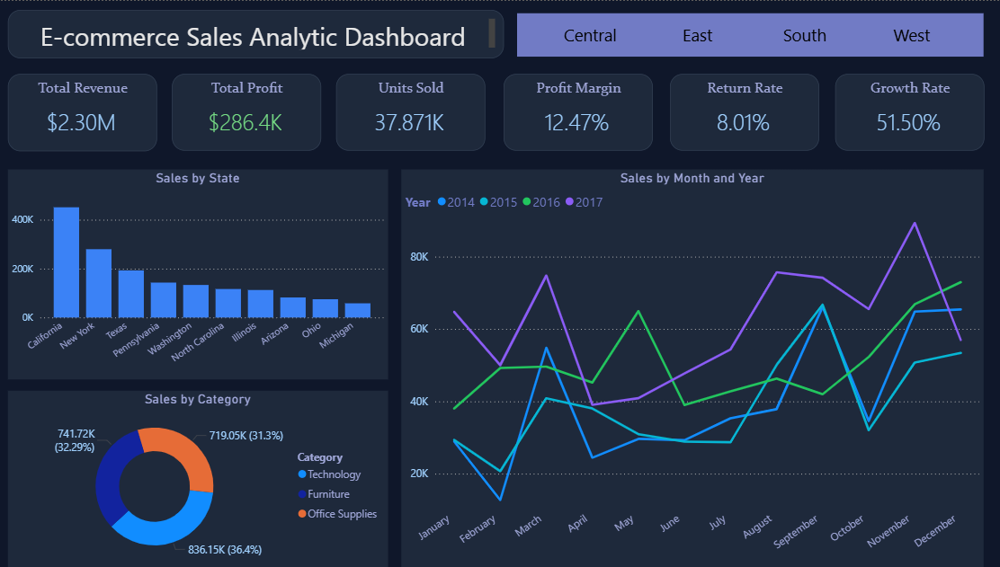

# 📊 E-commerce Sales Analytics Dashboard

Developed an end-to-end E-commerce Sales Analytics Dashboard using Power BI, SQL, Excel, and Power Query to analyze sales performance, profitability, customer behavior, and shipping efficiency.

## 🔍 Key Analysis Areas

- Sales & Profit Analysis
- Product & Category Performance
- Customer & Shipping Insights
- Regional Performance Tracking
- Seasonal Demand Analysis
- KPI Monitoring & Business Recommendations

## 🛠️ Tools Used

- Power BI
- SQL
- Excel
- Power Query
- DAX
- Data Modeling

## 💡 Key Insights

- Furniture category generated strong revenue but lower profit margins.
- East & West regions contributed majority of overall profit.
- Standard Class accounted for nearly 60% of shipments.
- Seasonal demand spikes observed during March, September, and November.

## 📷 Dashboard Preview

